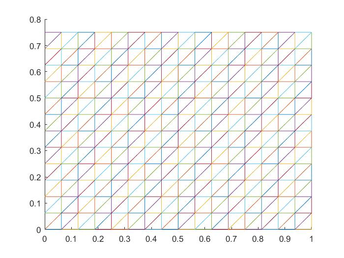

# Bachelor Thesis

This is my bachelor thesis which is Finite Element Analysis
of A Quadratic Eigenvalue Problem Arising in Dissipative Acoustics.
In my thesis, the method used is finite element method with zeroth-order 
Raviart-Thomas elements, which results in a quadratic eigenvalue
problem. In order to solve the quadratic eigenvalue problem arising
in dissipative acoustics, the Matlab eigensolver eigs is used to find
eigvalues corresponding to the vibration modes. 

## Authors

- [Le Dinh Tan](https://github.com/ledinhtan)

## Problem

The programming language is written by Matlab 2015a version. I applied the code
to solve the following problem: Find the eigenvalues corresponding to the vibration modes of a 2D
rectangular rigid cavity filled with air and with one absorbing
wall as that shown in the Figure 1:

The mesh creating by my code is shown as the follows:

We may run the code to see the numerical results.
